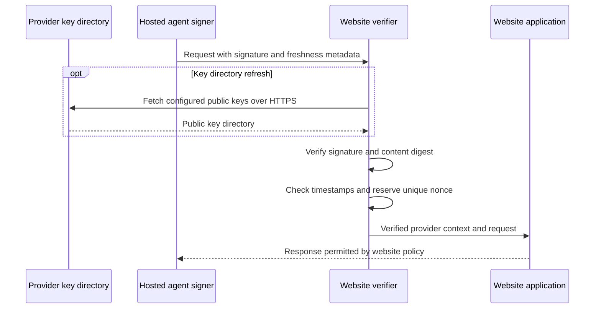

# SAR — Signed Agent Requests: design and build plan

Version 0.0.1 · 6 October 2026

We propose a way for agent providers to identify their HTTP traffic using signed requests. Providers publish public keys on their official domains. Their agents attach a signature, creation time, expiry, and unique request identifier to each outbound request. Websites verify these locally and decide how to serve the identified traffic.

Our recommended first build is a signing SDK, verification middleware, and a demonstration website. Use HTTP Message Signatures and Web Bot Auth as the foundation. Keep the first pilot focused on requests made by a provider's hosted agents to public read endpoints. This document records the idea, proposes implementation defaults, and defines what the pilot must prove.

## What this solves

The problem described in the motivating post is the absence of a widely accepted way for agents to identify themselves so service providers can adjust their interfaces and policies. Our proposal supplies that identification mechanism for participating agents.

A website could recognize an approved provider and serve structured content, apply a provider-specific rate limit, or direct the agent to an appropriate endpoint. If websites give identified agents useful and predictable access, legitimate agents have less reason to conceal their identity.

The protocol establishes that a holder of a key endorsed by a particular provider domain signed the covered request. Recognition of that domain as a particular company comes from the website's configuration or other trusted onboarding. Signature verification alone does not establish that a specific model produced the request, that a human authorized an action, or that the agent behaves safely. Unsigned traffic can still contain both humans and agents.

The public/private-key principle resembles SSH authentication. For the pilot, a configured provider domain and its HTTPS key directory provide the trust anchor. An additional certificate authority for agent identities is unnecessary at this stage.

## Build on existing standards

[HTTP Message Signatures RFC 9421](https://www.rfc-editor.org/rfc/rfc9421.html) defines how to sign HTTP components using `Signature-Input` and `Signature`. It supplies the serialization rules we need to avoid different interpretations of the same request.

The [Web Bot Auth protocol draft](https://datatracker.ietf.org/doc/html/draft-ietf-webbotauth-httpsig-protocol-00) applies message signatures to automated traffic, with `Signature-Agent` for key discovery and a public key directory. It is work in progress; we should pin the version we implement and track changes.

Our implementation should add a documented, stricter application profile for the pilot: bind each signature to the exact request, require a short lifetime, and reject reused identifiers. These are our proposed requirements, not a claim that every Web Bot Auth implementation already enforces them. The adoption opportunity is dependable integration for providers and websites using these standards.

## The request flow

The provider creates a signing key pair and publishes the public key. Its hosted agent signs the final request before sending it over HTTPS. The website looks up the configured provider's keys, verifies the request, checks freshness and replay, and then applies its access policy. Public keys can be cached, so most requests need no external verification call.



The normal flow has no server-issued challenge. A signed timestamp bounds freshness; a signed random nonce identifies the request. A future challenge mechanism could request a fresh signature when needed, but the pilot does not depend on it.

## Proposed pilot profile

### Provider identity and keys

Use a provider origin such as `https://provider.example` and publish its directory at `/.well-known/http-message-signatures-directory`. Configure approved provider origins at the website. Derive key identifiers using JWK thumbprints according to the pinned protocol version.

Start with an Ed25519 signing key dedicated to this service and environment. The private key stays inside provider-controlled infrastructure. The signing SDK should accept a signer interface so we can replace the pilot's secret-backed implementation with an isolated signing service or a compatible managed key system later.

The website obtains the public key from the configured provider directory. It must not trust a public key supplied alongside the request or discover a key on one domain and attribute it to another. Index cached keys by both the verified provider directory and key identifier.

Self-hosted agents would need their own operator identities or provider-issued credentials. Delegating provider identity to individual client sessions is a later design problem.

### Signature coverage

Use the standard signature base rather than inventing a separately signed JSON envelope. The conceptual payload discussed during brainstorming maps to these components:

| Information | Proposed coverage |
| --- | --- |
| HTTP method | `@method` |
| Destination and resource including query | `@target-uri` |
| Request content | Signed `Content-Digest` with SHA-256 |
| Provider identity discovery | The matching `Signature-Agent` member |
| Creation and expiry | Signed `created` and `expires` parameters |
| Unique request identifier | Signed `nonce` parameter |
| Key and protocol selection | Signed `keyid`, `alg`, and `tag` parameters |

Require the content digest for every pilot request, including the digest of empty content. Compute it from the transmitted content bytes and verify it before application processing. Do not parse and reserialize JSON to obtain those bytes. [RFC 9530](https://www.rfc-editor.org/rfc/rfc9530.html) defines `Content-Digest` and the content it covers.

The first public-read pilot rejects request bodies, `Authorization`, and `Cookie` on its GET and HEAD routes. If we later support bodies, also cover relevant content metadata such as `Content-Type` and `Content-Encoding`. Before supporting requests with cookies or authorization, define coverage for those fields and any other inputs that affect the action. Provider identity does not replace the application's user authorization checks.

Sign only after the HTTP client has finalized the URL and headers. A redirect requires a new request and a new signature for the new destination. Browser navigation, cookies, CORS, and interception of subresource requests require a separate browser integration; a fetch wrapper is enough for the first pilot.

### Freshness and replay

Proposed defaults are a maximum signature lifetime of 60 seconds, no more than 5 seconds of tolerated future clock skew, and a nonce generated from at least 128 random bits. Require integer timestamps, `created <= now + 5`, `expires > created`, `expires - created <= 60`, and `now < expires`. These are tuning choices for our pilot.

A timestamp alone allows the same signed request to be resent while valid. After successful cryptographic verification, atomically reserve `(verified provider, key identifier, nonce)` in a shared replay store. A duplicate reservation fails. Keep the reservation until the last possible acceptance time, with a small retention margin for verifier clock differences. [RFC 9421 discusses signature replay and nonce handling](https://www.rfc-editor.org/rfc/rfc9421.html#section-7.2.2).

For the pilot, use one region and a shared Redis store with an atomic set-if-absent operation. A per-process memory cache would allow duplicates across replicas. A future deployment across regions needs an explicit consistency design; independent regional nonce caches do not provide global replay rejection.

The client generates a fresh nonce when retrying. Before adding state-changing operations, define a separate, signed idempotency key and application behavior for repeated operations. A fresh transport nonce does not prevent the same purchase or booking from being executed twice.

### Website verification and policy

The verifier performs bounded parsing, validates the required coverage and algorithm, resolves the configured provider's key, checks the signature and actual content digest, checks timestamps, and reserves the nonce. Only then does it expose a verified identity to the application. Reject signatures that cover fewer components than our profile requires.

Use a typed internal result with separate fields for identity status and policy outcome. Useful identity statuses include verified, unsigned, invalid, and unverifiable because a required dependency is unavailable. Policy can allow, rate limit, or deny a verified identity independently of its cryptographic status.

On the pilot's designated agent endpoint, unsigned and invalid requests receive no verified-agent access. If the key cannot be resolved or the replay store is unavailable, return a temporary failure rather than grant privileges. Existing public routes can continue under their ordinary access rules without treating unsigned requests as human.

Middleware should write verified identity into server-controlled context. At a reverse proxy, strip any client-supplied verification headers before creating trusted internal headers. Run verification and access policy before any cache can serve a response on the agent endpoint. Verify before URL rewriting or content transformations, and reconstruct the external URL only from trusted proxy configuration. Do not let untrusted forwarded headers decide the signed destination.

## What we build first

### Components

| Component | First responsibility |
| --- | --- |
| Provider key directory | Publish the dedicated public keys and support rotation |
| Signing SDK | Sign finalized fetch requests through a pluggable signer |
| Verification middleware | Enforce the profile and expose verified identity |
| Replay store adapter | Atomically reject reused nonces across replicas |
| Website policy adapter | Configure provider access and rate limits |
| Demonstration website | Show recognized traffic receiving a useful response |
| Interoperability fixtures | Verify behavior against independently produced signatures |

TypeScript with Bun is the implementation stack for the SDK, middleware, and demo. Use Bun's HTTP server and Redis client, its supported `node:crypto` APIs, and tested structured-field/message-signature libraries. Redis provides the shared replay store. The protocol remains independent of this stack.

[Cloudflare's Web Bot Auth repository](https://github.com/cloudflare/web-bot-auth) contains TypeScript and Rust implementations and examples worth evaluating. Its README states that the software has not been audited. Check the actual supported draft and signature coverage, pin the dependency version or commit, and test independent vectors before relying on it. Do not assume two implementations interoperate because they use the same standard name.

### Milestones

1. **Freeze the pilot contract.** Record the draft version, required components, verification outcomes, timestamp rules, and replay behavior. Publish matching test vectors with keys explicitly marked for testing.
2. **Prove signing and verification.** Send a signed public-read request from one hosted agent to one verifier. Verify independently produced vectors so the signer and verifier cannot pass solely because they share the same bug.
3. **Add operational controls.** Implement bounded directory caching, coordinated nonce checks, key rotation, dependency failures, and provider rate limits. Run the verifier on multiple replicas against one replay store.
4. **Demonstrate useful access.** Give a configured provider an agent endpoint that returns the website's public catalog as structured data under a documented rate limit. Record verification outcomes and timings.
5. **Run a small external pilot.** Integrate a second independently implemented client and one independently operated website. Use their results to refine the SDK and middleware before expanding language or platform support.

The initial prototype is complete when a legitimate request is accepted, modified and replayed requests are rejected, and the website can apply a provider policy without contacting a central identity service for each request.

### Validation requirements

The implementation must demonstrate rejection of changed methods, destinations, query strings, content digests, content bytes, and provider claims. It must also reject expired signatures, excessive lifetimes, missing coverage, disallowed algorithms, unknown keys, and timestamps beyond the chosen skew allowance.

Submit the same valid request concurrently to two replicas: only one may reserve the nonce and proceed. Invalid signatures must not consume nonce reservations. Show that key rotation works across directory refreshes, that local emergency key denial overrides cached keys, and that dependency failures never grant verified-agent access.

Check that a verified provider can still be denied or rate limited by policy. Measure signing latency, cached verification latency, key refresh latency, replay-store latency, and accepted/rejected request counts. Set performance targets after measuring the pilot environment.

## Key operations and compatibility

Preload configured provider directories and refresh them in the background. Bound cache lifetime, response size, lookup time, and refresh attempts for unknown key IDs. The pilot fetches only configured HTTPS origins and does not follow redirects; this avoids turning request-controlled discovery into arbitrary server-side network access.

During routine rotation, publish the replacement key before using it. Keep the old key published through the refresh window and the lifetime of its last legitimate requests, then remove it. Document how long cached keys can remain accepted. For compromise response, allow website operators to deny a key immediately while distributing a provider's removal or revocation update.

A signing key grants the ability to represent the provider. Limit access to the signing operation, authenticate callers of any remote signing service, and keep production keys out of client bundles, prompts, logs, and test fixtures. The first signing service should issue signatures only for requests permitted by its own outbound policy.

There is a concrete compatibility difference today: [Cloudflare's documented integration](https://developers.cloudflare.com/bots/reference/bot-verification/web-bot-auth/) uses an older string form of `Signature-Agent`, rejects the newer dictionary form, and does not maintain a database of used nonces. Therefore, our strict profile needs its own replay checks. Cloudflare verification by itself does not demonstrate the guarantees defined here.

Target the September 2026 IETF draft for our reference pair. If a pilot needs Cloudflare's deployed format, implement and test an explicitly selected compatibility mode, including its supported component set. Verify the version intended for each destination; do not silently weaken required request binding or replay protection to obtain acceptance.

## Decisions for the next iteration

The initial implementation uses provider-level identity, hosted HTTP clients, configured trust anchors, direct per-request signatures, public read routes, and a shared replay store in one region. The runnable project uses Bun; see [the README](README.md) and [implemented profile](docs/protocol.md) for setup and exact supported behavior.

The next decisions are which provider and website to pilot with, which signature library passes the required vectors, and whether the initial deployment needs Cloudflare compatibility. Browser support, session delegation, user consent, and state-changing operations should follow a demonstrated public-read flow.

Provider identity is public. Log the verified provider, key identifier, verification result, policy outcome, and timings without logging private keys, raw authorization values, or request bodies. Avoid publishing a stable user identifier across websites; the provider-level pilot does not need one.

## Illustrative request shape

The following uses the draft's dictionary form of `Signature-Agent`. Angle-bracket values are placeholders, so this is an illustration rather than a valid test vector. The long `Signature-Input` value must be generated by the library. The content digest shown is for an empty body.

```http
GET /catalog?category=books HTTP/1.1
Host: shop.example
Content-Digest: sha-256=:47DEQpj8HBSa+/TImW+5JCeuQeRkm5NMpJWZG3hSuFU=:
Signature-Agent: agent="https://provider.example"
Signature-Input: agent=("@method" "@target-uri" "content-digest" "signature-agent";key="agent");created=<unix-seconds>;expires=<unix-seconds-plus-60>;keyid="<JWK-thumbprint>";alg="ed25519";nonce="<random-base64url>";tag="web-bot-auth"
Signature: agent=:<base64-signature>:
```

The verifier reconstructs the signature base from the incoming request according to the pinned standards. It compares the content digest to the actual content and derives the provider identity from the configured key directory. An unverified identity header is a claim until these checks succeed.
